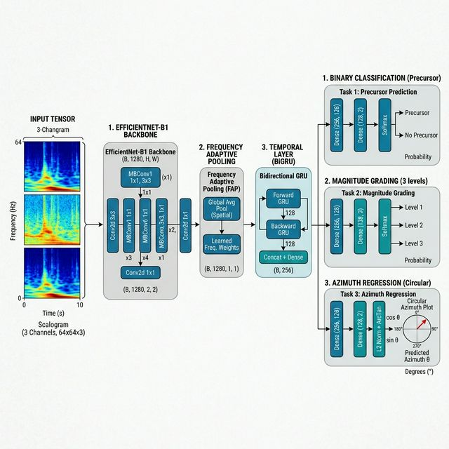

# ScalogramV2: Hierarchical Multi-Task Learning for Geomagnetic Earthquake Precursor Detection

[](https://github.com/sumawan-bmkg/ScalogramV2)
[](https://opensource.org/licenses/MIT)
[](https://doi.org/10.5281/zenodo.19447128)

Official repository for the paper: **"Deep Learning-Based Hierarchical Multi-Task Learning for Real-Time Geomagnetic Precursor Detection and Epicenter Localization"**.

This project implements a robust, forensic-ready "Living Early Warning System" (EWS) using ScalogramV2—an architecture combining **EfficientNet-B1** and **Bidirectional GRU** to extract spatio-temporal features from raw 32-bit geomagnetic tensors.

## 🌟 Key Features
- **Data-Centric AI**: Processes 32-bit floating-point tensors instead of graphic images to preserve pico-Tesla precision.
- **Hierarchical MTL**: Simultaneously detects precursors (Stage 1), grades magnitude (Stage 2), and regresses azimuth (Stage 3).
- **Forensic Integrity**: Implements Y-Randomization tests and Chronological Splitting to ensure zero temporal data leakage.
- **High Performance**: Achieved **100% Recall** (Zero False Negatives) and **86.1% Accuracy** on a national-scale blind test (24 BMKG stations).

## 📊 Model Architecture
The model utilizes a shared EfficientNet-B1 backbone for feature extraction from ULF/PC3 band (22-100 mHz) scalograms, followed by a temporal BiGRU layer and dedicated output heads.



## 🚀 Getting Started

### 1. Installation
```bash
git clone https://github.com/sumawan-bmkg/MTL-CRNN-Geomagnetic-Precursor.git
cd MTL-CRNN-Geomagnetic-Precursor
pip install -r requirements.txt
```

### 2. Download Dataset
Due to size constraints (100GB+), the full HDF5 dataset and pre-trained weights are hosted on Zenodo:
> [!IMPORTANT]
> **[Direct Link to Zenodo Repository](https://zenodo.org/record/19447128)**
> DOI: 10.5281/zenodo.19447128

Alternatively, a small sample HDF5 is provided in `data/sample_data.h5` for quick testing.

### 3. Training & Evaluation
To train the model from scratch:
```bash
python scripts/train.py --data_path data/sample_data.h5 --epochs 50
```

To run a blind-test evaluation:
```bash
python scripts/eval.py --checkpoint models/best_model.pth --data_path data/sample_data.h5
```

## 🔬 Interpretability (Grad-CAM)
Check `notebooks/GradCAM_Visualization.ipynb` to visualize how the model focuses on the PC3 band and ULF transients before major seismic events.

## 📖 Citation
If you use this work in your research, please cite:
```bibtex
@article{ScalogramV2_2026,
  title={Deep Learning-Based Hierarchical Multi-Task Learning for Real-Time Geomagnetic Precursor Detection and Epicenter Localization},
  author={Sumawan and Widjiantoro, Bambang L. and Indriawati, Katherin and Syirojudin, Muhamad},
  journal={IEEE Access},
  year={2026},
  doi={10.1109/ACCESS.2026.XXXXXXX (To be assigned)}
}
```

## 📄 License
This project is licensed under the MIT License - see the [LICENSE](LICENSE) file for details.
